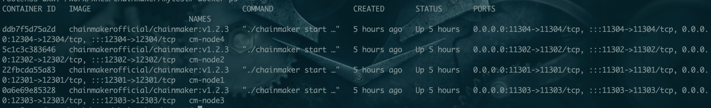
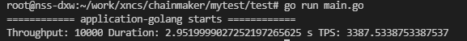

# 长安链介绍
“长安链·ChainMaker”具备自主可控、灵活装配、软硬一体、开源开放的突出特点，由北京微芯研究院、清华大学、北京航空航天大学、腾讯和百度等知名高校、企业共同研发。取名“长安链”，喻意“长治久安、再创辉煌、链接世界”。

长安链作为区块链开源底层软件平台，包涵区块链核心框架、丰富的组件库和工具集，致力于为用户高效、精准地解决差异化区块链实现需求，构建高性能、高可信、高安全的新型数字基础设施，同时也是国内首个自主可控区块链软硬件技术体系。

长安链的应用场景，涵盖供应链金融、碳交易、食品追溯等一系列关乎国计民生的重大领域。

长安链拥有高效并行调度算法、高性能可信安全智能合约执行引擎、流水线共识算法等国际领先的区块链底层技术，具备高并发、低延时、大规模节点组网等先进技术优势，交易吞吐能力可达10万TPS，位居全球领先水平；

通过[媒体(https://www.eet-china.com/mp/a56840.html)](https://www.eet-china.com/mp/a56840.html)(如下图所示)了解到, 长安链以区块链专用加速芯片为核心提供超高的区块链数据处理性能。与纯软件平台相比，区块链专用加速板卡的数字加密、解密处理速度提升20倍，转账、支付交易速度则提升了50倍。

# TPS验证
长安链的介绍中，提到自己的TPS达到了10w。(个人猜想，这个10w应该有用到这个芯片) 
如果不用加速芯片等技术，那么也就是对普通机器,使用长安链的TPS理论上可达到10wTPS/50 = 2000TPS.
 
此项目针对长安链的性能,进行TPS测试验证
测试网络为手动生成四节点网络，利用docker单机启动 

ps: 由于接触的还不够深，若有错误，请指正 

# 测试机环境介绍
由于机器配置的不同，可能存在因配置问题性能不同。 

| cpu型号               | 内存                 | 硬盘                  | 测试合约                         | 数据量         |
| --------------------- | -------------------- | --------------------- | -------------------------------- | -------------- |
| i7-10500(6核心12线程) | 金士顿骇客神条(16GB) | 西部数据480GB固态硬盘 | rust-asset-management-1.0.0.wasm | 1K/1w/10w/100w |

# 验证过程
## 2021.07.21 第一次测试
测试方案解释：
通过GoRoutine连接多个ChainClient，多个ChainClient进行并发发起交易,计算这些交易的总用时，最终计算TPS为1,不太合理。 

## 2021.07.21 第二次测试
经过群里大佬提醒，对相关参数进行调整,TPS达到3k多
| 参数链接                                                     | 参数说明                                  | 调整前 | 调整后  |
| ------------------------------------------------------------ | ----------------------------------------- | ------ | ------- |
| https://docs.chainmaker.org.cn/dev/chainmaker-go-sdk.html#4.1.9 | 4.1.9的InvokeContract接口的withSyncResult | true   | false   |
| https://git.chainmaker.org.cn/chainmaker/chainmaker-go/-/blob/v1.2.3/config/wx-org1/chainmaker.yml#L47 | max_txpool_size，区块链的交易池           | 50000  | 5000000 |

# 验证结论
待进一步验证
